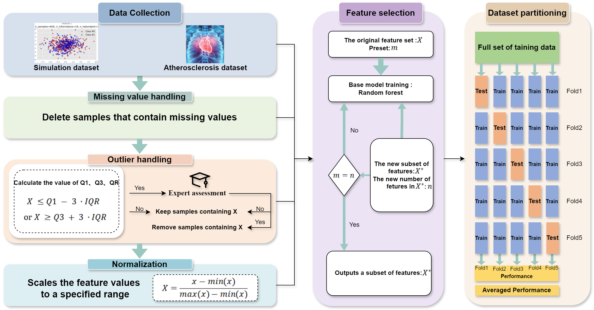

# AWABoost-svm
We present an optimized AwaBoost-SVM model tailored for heart disease classification.  This repository includes a pre-trained model, structured testing data, and an evaluation script to analyze model performance Ideal for health data analysis applications and binary classification tasks.



# Optimized AwaBoost-SVM Model for Heart Disease Classification

Python implementation of an optimized **AwaBoost-SVM model** designed for heart disease classification using the Cleveland dataset.

---

## Introduction

Heart disease remains one of the leading causes of morbidity and mortality worldwide, making accurate and early diagnosis crucial. This project presents an optimized AwaBoost-SVM model that leverages both **AwaBoost** (Adaptive Boosting) and **Support Vector Machine (SVM)** techniques to enhance classification performance for heart disease prediction.

Unlike traditional SVM models, AwaBoost-SVM combines the boosting framework of AwaBoost with the binary classification power of SVM, allowing for improved robustness and accuracy. We optimize key hyperparameters \( \theta \) and \( C \) using Bayesian optimization to further improve the model's predictive accuracy. This model was trained and validated on the Cleveland heart disease dataset, and its performance is evaluated using accuracy, precision, recall, F1-score, and AUC metrics.

.png)

---

## Prerequisites

- Python 3.9
- NumPy
- Pandas
- Scikit-Learn
- Joblib

## Getting Started

### Conda Environment Setting

To set up the environment, follow these commands:

```bash
conda create -n AwaBoostSVM python=3.9
conda activate AwaBoostSVM
pip install numpy pandas scikit-learn joblib
```

### Project Structure

- **`awaboost_svm_model.pkl`**: Pre-trained and optimized AwaBoost-SVM model file.
- **`heart_cleveland_upload.csv`**: Cleveland heart disease dataset for testing the model.
- **`test_model.py`**: Python script to load the model and dataset, perform predictions, and evaluate performance using metrics.

## Training and Testing

This project is set up for immediate testing with a pre-trained model. Follow the steps below to evaluate the model on the Cleveland dataset:

1. Ensure that the `awaboost_svm_model.pkl` and `heart_cleveland_upload.csv` files are located in the root directory of this repository.
2. Run the `test_model.py` script to load the model, make predictions on the dataset, and print evaluation metrics.

### Running the Test Script

```bash
python test_model.py
```

### Expected Output

The `test_model.py` script will output the following performance metrics:

- **Accuracy**: The percentage of correct predictions made by the model.
- **Precision**: The proportion of positive identifications that were actually correct.
- **Recall**: The proportion of actual positives that were identified correctly.
- **F1-score**: The harmonic mean of precision and recall, providing a balanced measure.
- **AUC (Area Under Curve)**: A metric that represents the degree of separability between classes.

---

### License

This repository is licensed under the MIT License.

--- 
